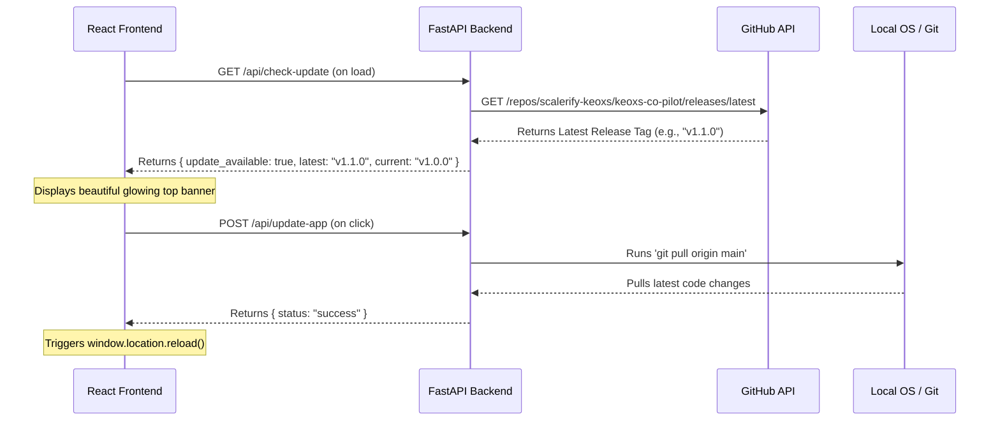

# Keoxs Co-Pilot: Versioning & 1-Click Update Architecture

This document provides a complete technical blueprint for implementing **Automatic Version Checking** and a **1-Click Update Mechanism** for Keoxs Co-Pilot, ensuring that local users always have access to the latest security patches, diagnostic algorithms, and AI improvements directly from GitHub.

---

## 1. Architectural Overview

Since Keoxs Co-Pilot runs as a hybrid local application (React Frontend + FastAPI Backend), we can leverage the local server's access to the computer's system commands to create a seamless, self-updating experience while maintaining 100% data privacy.



---

## 2. Core Components

### A. Local Version Definition
We define the local version inside a single JSON file at the root of the project to act as the single source of truth for the local instance:

`version.json`
```json
{
  "version": "1.0.0"
}
```

### B. Backend: Version Verification & Pull Endpoints
The FastAPI backend handles the communication with GitHub and the execution of the update script.

```python
import httpx
import json
import subprocess
from fastapi import APIRouter, HTTPException

router = APIRouter()

LOCAL_VERSION_PATH = "version.json"
GITHUB_RELEASES_URL = "https://api.github.com/repos/scalerify-keoxs/keoxs-co-pilot/releases/latest"

def get_local_version() -> str:
    try:
        with open(LOCAL_VERSION_PATH, "r") as f:
            return json.load(f).get("version", "1.0.0")
    except:
        return "1.0.0"

@router.get("/api/check-update")
async def check_update():
    current_version = get_local_version()
    try:
        async with httpx.AsyncClient() as client:
            response = await client.get(GITHUB_RELEASES_URL, headers={"User-Agent": "Keoxs-Copilot"})
            if response.status_code == 200:
                latest_release = response.json()
                latest_version = latest_release.get("tag_name", "1.0.0").replace("v", "")
                
                # Simple semantic comparison
                update_available = latest_version != current_version
                
                return {
                    "update_available": update_available,
                    "current_version": current_version,
                    "latest_version": latest_version,
                    "release_notes": latest_release.get("body", "")
                }
    except Exception as e:
        # Fails silently if offline
        pass
    return {"update_available": False, "current_version": current_version, "latest_version": current_version}

@router.post("/api/update-app")
async def update_app():
    """
    Triggers a git pull locally to fetch the latest code from GitHub.
    """
    try:
        # 1. Run git pull
        pull_result = subprocess.run(["git", "pull", "origin", "main"], capture_output=True, text=True, check=True)
        
        # 2. Return success
        return {
            "status": "success",
            "output": pull_result.stdout
        }
    except subprocess.CalledProcessError as e:
        raise HTTPException(
            status_code=500, 
            detail=f"Failed to update code. Please run 'git pull' manually. Error: {e.stderr}"
        )
```

### C. Frontend: Notification Banner
A premium, non-intrusive glowing banner in `App.jsx` prompts the user when an update is available:

```javascript
import React, { useState, useEffect } from 'react';

function UpdateBanner() {
  const [updateInfo, setUpdateInfo] = useState(null);
  const [isUpdating, setIsUpdating] = useState(false);

  useEffect(() => {
    fetch('http://localhost:8001/api/check-update')
      .then(res => res.json())
      .then(data => {
        if (data.update_available) {
          setUpdateInfo(data);
        }
      });
  }, []);

  const handleUpdate = async () => {
    setIsUpdating(true);
    try {
      const response = await fetch('http://localhost:8001/api/update-app', { method: 'POST' });
      if (response.ok) {
        alert("🎉 Keoxs Co-Pilot updated successfully! Reloading page...");
        window.location.reload();
      } else {
        const err = await response.json();
        alert(`Failed to update: ${err.detail}`);
      }
    } catch {
      alert("Error connecting to local backend during update.");
    }
    setIsUpdating(false);
  };

  if (!updateInfo) return null;

  return (
    <div className="update-banner" style={{
      background: 'linear-gradient(90deg, #10b981 0%, #059669 100%)',
      color: 'white',
      padding: '10px 20px',
      fontSize: '13px',
      fontWeight: '600',
      display: 'flex',
      justify-content: 'space-between',
      alignItems: 'center',
      borderRadius: '8px',
      marginBottom: '20px',
      boxShadow: '0 4px 12px rgba(16, 185, 129, 0.2)'
    }}>
      <span>🚀 A new version (v{updateInfo.latest_version}) is available! (Current: v{updateInfo.current_version})</span>
      <button 
        onClick={handleUpdate} 
        disabled={isUpdating}
        style={{
          background: 'white',
          color: '#059669',
          border: 'none',
          padding: '6px 14px',
          borderRadius: '6px',
          cursor: 'pointer',
          fontWeight: 'bold',
          fontSize: '12px'
        }}
      >
        {isUpdating ? "Updating..." : "Update Now"}
      </button>
    </div>
  );
}
```

---

## 3. Key Advantages

1. **Zero Package Bloat**: Relying on standard git commands via `subprocess` means we don't have to install heavy custom binary update engines.
2. **100% Privacy Preservation**: The check is performed strictly in read-only mode, and the repository is pulled from the public GitHub without exposing any user data, API keys, or uploaded search term reports.
3. **Frictionless Experience**: The user never needs to open their terminal, type git commands, or download a manual zip archive. A single click keeps their local machine perfectly synced with our firm's engineering core.
